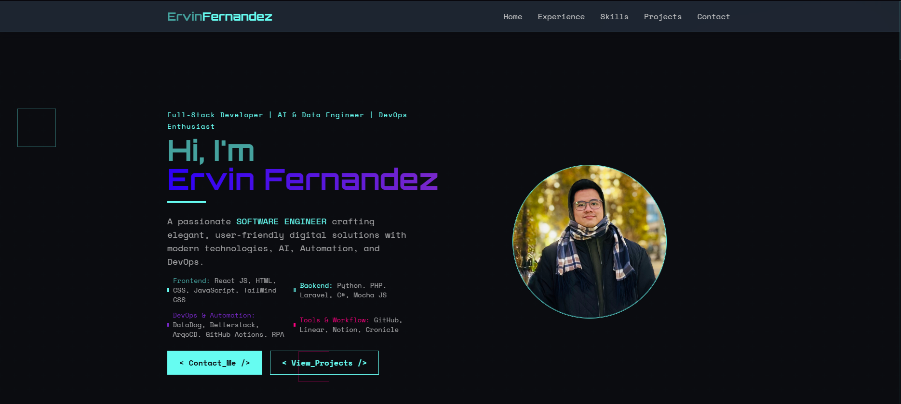

# Ervin Fernandez - Portfolio Website



## 🚀 Overview

A modern, tech-themed portfolio website showcasing my skills, projects, and professional experience. This portfolio is designed with a sleek, cyberpunk-inspired UI featuring animated elements, responsive design, and interactive components.

## ✨ Features

- **Modern Tech Design**: Cyberpunk-inspired UI with animated elements and tech-themed components
- **Responsive Layout**: Fully responsive design that works on all devices
- **Interactive Navigation**: Fixed header with smooth scrolling and active section highlighting
- **Comprehensive Sections**:
  - Hero section with professional summary
  - Detailed work experience with collapsible sections
  - Skills categorized by specialty
  - Project showcase with filtering capability
  - Contact form
- **Performance Optimized**: Fast loading times and smooth animations

## 🛠️ Technologies Used

- **Frontend Framework**: React with TypeScript
- **Styling**: TailwindCSS with custom tech theme
- **Build Tool**: Vite
- **Deployment**: GitHub Pages

## 🔧 Installation & Setup

1. **Clone the repository**

   ```bash
   git clone https://github.com/Ervszzz/personal-website.git
   cd personal-website
   ```

2. **Install dependencies**

   ```bash
   npm install
   ```

3. **Run development server**

   ```bash
   npm run dev
   ```

   The site will be available at `http://localhost:5173/`

4. **Build for production**
   ```bash
   npm run build
   ```

## 📁 Project Structure

```
src/
├── assets/         # Images, icons, and other static assets
├── components/     # React components
├── App.tsx         # Main application component
├── index.css       # Global styles
└── main.tsx        # Application entry point
```

## 🎨 Customization

The portfolio is designed to be easily customizable:

- Update personal information in the Hero component
- Modify work experience in the WorkExperience component
- Add or remove skills in the Skills component
- Update projects in the Projects component
- Change colors and theme in the TailwindCSS configuration

## 📱 Responsive Design

The portfolio is fully responsive and optimized for:

- Desktop (1200px+)
- Laptop (1024px)
- Tablet (768px)
- Mobile (480px)

## 🔗 Links

- [Live Demo](#)
- [GitHub Repository](https://github.com/Ervszzz/personal-website)

## 📄 License

This project is proprietary and protected by copyright law. All rights reserved. The source code may not be reproduced, distributed, or used without explicit written permission from Ervin Fernandez. See the LICENSE file for details.

---

Designed and developed by Ervin Fernandez © 2024
